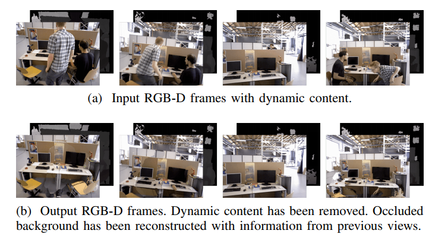
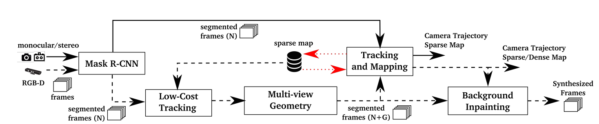
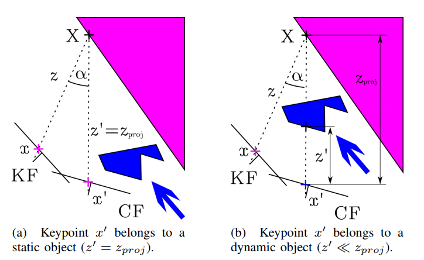
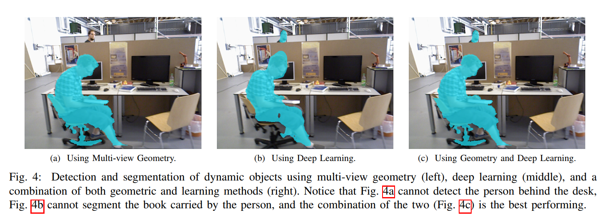

# DynaSLAM

https://zhuanlan.zhihu.com/p/133212711

CNN + 多视图几何判断动态点

## Abstract

​	假设环境刚体性在SLAM算法中是典型的。这种强假设限制了大多数SLAM在真实环境中的使用，这是一些相关应用的目标，如服务机器人或自动驾驶。Bescos等人展示了DynaSLAM，一种视觉SLAM系统，建立在ORB-SLAM2上，增加了**动态物体检测**和**背景修补**。DynaSLAM在动态场景中是鲁棒的。作者能够通过多视图几何，深度学习或者两者同时来检测动态物体。得到的静态场景地图允许修补被动态物体遮挡的帧背景。DynaSLAM 超过了标准SLAM的表现在高动态环境中。同时，它也估计了环境静态部分的地图，对于真实环境的长期应用是必要的。

## Introduction

​	在我们的工作中，我们提出一种在线算法来解决RGB-D，双目和单目SLAM中的动态物体。这被解决通过增加一个前端到SOTA ORB-SLAM2系统中，为了具有更准确的跟踪和复用场景地图的作用。在单目和双目例子中，我们的目的是使用CNN到逐像素的分割帧中的**先验动态物体**，从而SLAM算法不会提取它们上的特征。在RGB-D的例子中，我们提出组合多视角几何模型和基于深度学习的算法用于检测动态物体并且之后从图片中移除它们，去除遮挡背景的瑕疵通过场景的修正信息（图1）。

## System Overview

双目和单目情况，图片经过Mask R-CNN网络，通过语义分割检测出动态先验；RGBD情况，多视图几何来辅助分割，更加准确。分割后，还可以填充被遮挡的静态部分(通过之前视图)。

​	这些被分割的帧是那些被用于获得相机轨迹和场景地图的帧。注意到如果场景中的运动物体不在CNN类别内，多视角阶段将会检测动态成分，但是准确可能会降低。

### A. CNN

​	为了检测动态物体，我们提出使用一个CNN，获得逐像素的图片语义分割。在我们的实验中，我们使用Mask R-CNN[19]，其是SOTA对于物体实例分割。Mask R-CNN可以同时获得逐像素语义分割和实例标号。对于该工作我们使用逐像素语义分割信息，但是实例标号能够在未来工作中被使用为了跟踪不同的运动物体，**我们使用Matterport的TensorFlow应用**

[matterport/Mask_RCNN: Mask R-CNN for object detection and instance segmentation on Keras and TensorFlow (github.com)](https://github.com/matterport/Mask_RCNN)

​	Mask R-CNN的输入是RGB原始图片。该想法是分割那些潜在动态或者可能运动的物体（人，自行车，汽车，摩托车，飞机，公交车，火车，货车，船，鸟，猫，狗，马，船，奶牛，大象，熊，斑马和长颈鹿）。我们考虑，对于大多数环境，动态物体很有可能被包含在这个列表中。如果其它类需要，在MS COCO中[20]训练的网络，可能使用新训练数据精修。

### B. Low Cost Tracking

​	去除通过Mask R-CNN实力分割得到的潜在运动物体的内部和周围像素。基于落在其他区域（静态区域）的特征点，使用轻量级的ORB-SLAM2[1]进行低成本相机跟踪。它投影地图特征到图片帧中，搜索图片静态区域的对应，并最小化重投影误差来优化相机位姿。

### C. Segmentation of Dynamic Content using Mask R-CNN and Multi-view Geometry 

​	通过使用Mask R-CNN，大多数动态物体可以被分割并且不被用于跟踪和建图。但是，**有一些物体不能被该方法检测到，因为它们不是先验动态的，但是可移动**。最新的例子是某人拿着一本书，一个人坐在椅子上移动，或者甚至是家具在长期建图中的变化。用于解决这些情形的方法在本节中被详细描述。

KF中的map point设为X，将其投影到CF(当前帧)中。如果α大于30°，则认为动态点；若zproj-z'(测量深度-投影深度)大于某阈值，则认为X为动态点(或被遮挡)。

​	到目前为止，我们知道哪个关键点属于动态物体，哪个不是。为了分类所有属于动态物体的像素，我们**扩展动态像素附近的深度图片中的区域**[21]。一个RGB帧的例子和它对应的动态掩膜可以被看到在图4(a)中。

​	由于两种方法的优劣势，我们考虑它们是互补的，并且因此它们的组合使用是一个有效的方法来达到准确的跟踪和建图。为了达到该目标，如果一个物体同时被该方法检测到，分割掩膜将会是几何方法。如果植被学习方法检测到，分割掩膜将也会包含该信息。该例子最终的分割图片可以在图4(c)中看到。分割的动态部分被移除从当前帧和地图中。

