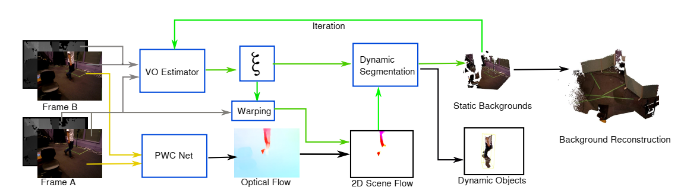
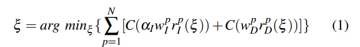
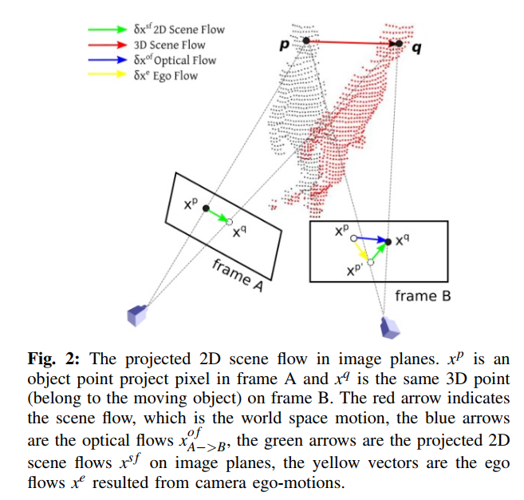
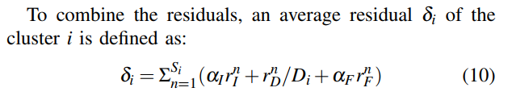
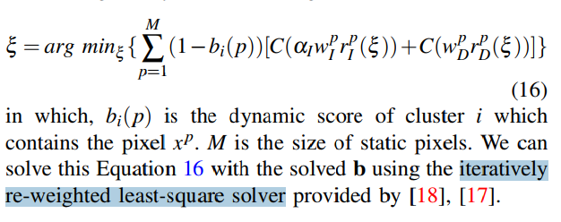
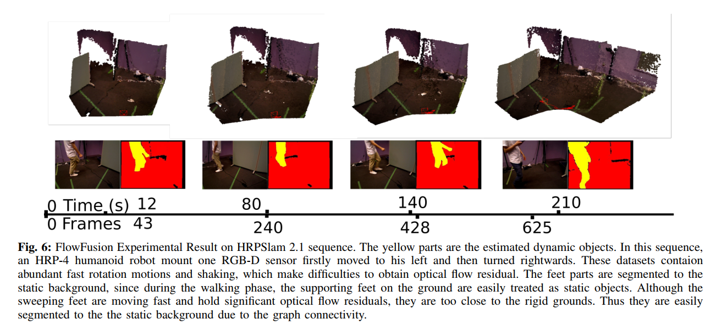

# FlowFusion: Dynamic Dense RGB-D SLAM Based on Optical Flow 

[TOC]

## Abstract

​	动态环境对于视觉 SLAM 来说是具有挑战性的，因为运动物体会遮挡静态环境特征并导致错误的相机运动估计。 在本文中，我们提出了一种新颖的密集 RGB-D SLAM 解决方案，该解决方案同时完成动态/静态分割和相机自我运动估计以及静态背景重建。 我们的新颖之处在于使用光流残差来突出 RGBD 点云中的动态语义，并为相机跟踪和背景重建提供更准确和有效的动态/静态分割。 公共数据集和真实动态场景的密集重建结果表明，与最先进的方法相比，所提出的方法在动态和静态环境中都实现了准确和高效的性能。

## Introduction

*图 1：提出的 FlowFusion 框架：输入两个连续的 RGB-D 帧 A 和 B，RGB 图像首先输入 PWC-net 进行光流（黄色箭头）估计。 同时，将 A 和 B 的强度和深度对馈送到鲁棒的相机自我运动估计器以初始化相机运动 x（在第 III-A 节中介绍）。 然后我们用 x 将帧 A 扭曲到 A' 并获得投影的 2D 场景流（第 III-B 节），然后将其应用于动态分割。 经过几次迭代（第 III-C 节，绿色箭头），实现了静态背景以进行重建。*

### OPTICAL FLOW BASED JOINT DYNAMIC SEGMENTATION AND DENSE FUSION 

### A. Visual Odometry in Dense RGB-D Fusion 

​	深度图->点云，再K-means聚类，每一个cluster视为一个刚体。假设机器人开始在静态环境中移动，x 可以通过考虑光度和深度残差的公式能量函数求解：

**这里，C是能量函数，如果不看能量函数，将其变成模的平方，那么就是正常误差计算。像素误差以及深度误差。** *见SLAM直接法*

### B.Optical Flow Residual Estimated by Projecting the Scene Flow 

​	

​	理论上，我们可以通过 x 来区分一个簇 Vi 是动态的还是静态的。 由于 (IA;DA) 使用 x 扭曲，然后我们计算每个簇的平均残差，真实背景不移动，它们的像素簇随着相机运动 x 移动，因此它们的残差很低。 与动态对象一起移动的动态簇应该包含高残差，因为它们的运动与相机运动 x 不一致。 因此，可以通过设置高和低 rI;rD 残差的阈值来提取动态簇。 然而，在实际情况下，强度和深度残差并不是很好的指标，原因是：*简略：①RGB图和深度图时间不能严格对齐②深度图边界测量不连续③测量范围越大深度图误差越大*

​	主要利用上图向量关系：**如果静态点，那么场景流向量=0；若动态点，场景流不为0。**利用这个关系，看点的残差，要比直接计算残差的效果好。

### C. Dynamic Clusters Segmentation 

​	到目前为止，我们已经使用 VO x 投影了帧 A，我们已经定义了三个残差，rI;rD 和 rF，分别与强度、深度和光流相关。 我们建议根据其平均残差来区分集群是静态的还是非静态的。 这将通过两个程序完成。 首先，我们计算一个度量来组合这三个残差，其次，我们组成一个最小化函数来限定集群的动态水平。

其中，Si是cluster大小，Di是该cluster的平均深度，αF和αI是权重。

​	**对于每个cluster，我们计算其动态等级bi ∈[0,1]，0代表静态。**

最后解一个迭代加权最小二乘问题即可：

可以理解为：**动态点误差大，视为外点，那么其权重w趋近于0，则bi则趋近为1；相反，静态点误差小，视为内点，那么其权重w趋近于1，bi则趋近为0。**这样，就可以区分动态点以及静态点了。

#### 附：迭代加权最小二乘

​	https://blog.csdn.net/weixin_43038150/article/details/103569467

​	https://www.cnblogs.com/walking-dream/p/4372873.html

## Experiment

​	为了评估提出的 FlowFusion 动态分割和密集重建方法，我们将 FF 的 VO 和映射结果与公共 TUM [19] 和 HRPSlam [20] 数据集中最先进的动态 SLAM 方法 SF、JF 和 PF 进行比较 . 前者提供了广泛接受的 SLAM 评估指标：绝对轨迹误差 (ATE) 和相对姿态误差 (RPE)。 要计算一条轨迹的 ATE，首先使用最小二乘法将其与 ground truth 对齐，然后直接比较相同时间戳下估计位置与 ground truth 之间的距离。

​	HRPSlam 2.1 序列的 FlowFusion 实验结果。 黄色部分是估计的动态对象。 在这个序列中，HRP-4 人形机器人安装了一个 RGB-D 传感器，首先向左移动，然后向右转。 这些数据集包含大量的快速旋转运动和晃动，这使得难以获得光流残差。 脚部分被分割到静态背景，因为在步行阶段，地面上的支撑脚很容易被视为静态对象。 尽管扫地脚移动得很快，并保留了显着的光流残差，但它们离刚性地面太近了。 因此，由于图的连通性，它们很容易被分割到静态背景。

## Conclusion

​	在本文中，我们提供了一种新颖的密集 RGB-D SLAM 算法，该算法联合计算出动态片段并重建静态环境。 新提供的动态分割和密集融合公式应用了先进的密集光流估计器，提高了动态分割的准确性和效率。 在线数据集和真实机器人应用场景的演示展示了在静态和动态环境中的竞争性能。