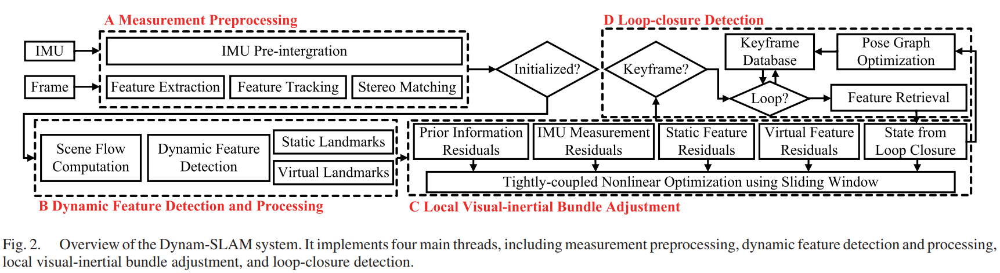
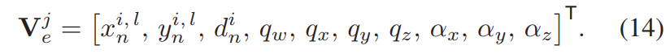
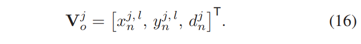
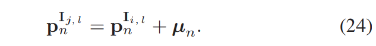

# Dynam-SLAM: An Accurate, Robust Stereo Visual-Inertial SLAM Method in Dynamic Environments

​	大多数现有的基于视觉的同时定位和映射 (SLAM) 系统及其变体仍然假设观察是绝对静态的，并且在动态环境中不能很好地工作。在这里，我们展示了 Dynam-SLAM (Dynam)，这是一种立体视觉惯性 SLAM 系统，能够在高动态环境中进行稳健、准确和连续的工作。我们的方法致力于将立体场景流与惯性测量单元 (IMU) 松散耦合以进行动态特征检测，并将动态和静态特征与 IMU 测量紧密耦合以进行非线性优化。首先，对测量噪声引起的场景流不确定性进行建模，以推导出地标的准确运动似然度。同时，为了应对高度动态的环境，我们还根据检测到的动态特征构建了虚拟地标。然后，我们构建了一个紧密耦合、基于非线性优化的 SLAM 系统，通过融合 IMU 测量和特征观察来估计相机状态

## II. RELATED WORK

### A. Literature Classification  文献分类

​	动态环境是当前 SLAM 系统无法回避的问题，并且已经提出了许多方法来应对这一挑战。 对于基于视觉的 SLAM，我们一般将动态环境中的状态估计方法分为两类：纯视觉方法和多传感器融合方法。 纯基于视觉的方法仅依靠图像信息来处理动态对象，例如语义分割方法[21]，几何约束方法[22]，以及上述方法的融合。 相比之下，多传感器融合方法[23]使用多个传感器融合信息，从而减少图像带来的动态影响。

### B. Semantic Segmentation Method 语义分割法

​	语义分割方法通常使用深度学习来识别和确定图像像素的运动属性[24]。 于等人。 [25] 提出了 DS-SLAM，它使用基于 Caffe 的 SegNet [26] 对图像像素进行实时语义分割。 斯科纳等人。 提出了静态融合 [27] 用于动态中的鲁棒和密集的 RGB-D SLAM环境，它检测移动物体并重建背景结构。

### C. Geometric Constraint Method

​	依赖几何约束的技术使用多视图几何[22]、运动相似性[28]和自运动约束[29]中定义的特定几何规则来分割静态和动态特征。 几何规则可以从极线、三角测量、基本矩阵估计或重投影误差 [16] 中得出。 例如，昆杜等人。 [30] 使用由车轮里程表构建的核线和“流矢量边界”约束来检测动态特征。 邹等人[31] 用三角法区分静态和动态特征。 纳拉亚纳等人。 [32]将概率模型定义为光流方向的相似性度量，它自动估计观察到的独立运动的数量。

### D. Geometry and Semantic Fusion Method 

​	可以合并几何约束和语义分割来处理动态特征。 肖等人。 [33]提出了Dynamic-SLAM，它使用紧密耦合的语义和几何信息来去除动态特征。 Bescos 等人 [34] 提出了 DynaSLAM，它可以通过多视图几何、Mask R-CNN [35] 或两者的组合来检测运动物体。

### E. Vision-centered Multisensor Fusion Method 

​	多传感器融合方法通过其他类型传感器提供的信息对视觉特征或物体进行动态识别。 金等人。 [36]使用IMU对图像帧进行旋转补偿，并将两帧之间特征的变换定义为对应的运动向量。 然后，速度传感器用于过滤运动矢量以获得静态地标。 Xu等人提出的OD-SLAM [37]系统。 使用车轮里程计获得静态特征，最后估计出更准确的姿势。 查韦斯-加西亚等人。 [38] 融合了来自三种类型传感器模块（激光雷达、雷达和摄像头）的输入，以检测和跟踪动态特征。

### F. Summary of Related Literature 

​	语义分割方法可以获得动态对象所在的像素区域，直接将动态特征与静态背景分离。然而，这种方法通常无法识别不完整的轮廓（例如，靠近相机的人或物体）和不在训练类别中的动态物体。几何约束法只关注视觉特征，计算速度快，理论模型相对简单。该方法一般先估计相机运动，然后使用随机样本一致性（RANSAC）算法确定动态特征的去除。但是，当遭受高动态环境时，初始变换估计将由主导的动态特征决定。前面的分析表明，当运动物体在图像中占据较大比例时，仅基于视觉的方法无法正确估计相机位姿。大多数以视觉为中心的多传感器融合方法在高度动态的环境中不能有效地利用动态特征，导致算法由于约束不足而难以收敛。

​	在本文中，我们使用相机和 IMU 的融合来估计高动态环境中的机器人状态。 高频IMU提供的平移和定向速度的精确预积分值可以有效区分动态特征，视觉重投影约束可以抑制IMU零偏移引起的发散和累积误差。

## III. OVERVIEW

### A. Workflow

​	我们的 Dynam-SLAM 系统的流程如图 2 所示。四个线程并行运行：测量预处理、动态特征检测和处理、局部视觉惯性束调整和闭环检测。 测量预处理线程负责处理视觉和IMU测量数据，包括图像特征提取和跟踪、立体匹配和IMU预集成。 动态特征检测和处理线程 (DFT) 用于场景流计算（参见第 IV 节）、动态特征检测（参见第 V 和 VI 节）和虚拟地标构建（参见第 VII-A 节）

紧耦合的IMU+视觉局部BA在VII-B章节。最后，回环检测部分在VIII。

### B. 符号规定

## IV. SCENE FLOW COMPUTATION

​	在本节中，我们将描述场景流计算方法。 场景流是为世界框架 [39] 中每个表面上的每个点运动定义的 3-D 矢量场，它是运动矢量的集合。

​	给定帧 i 和 j 中的两个时间连续立体图像对，如图 1 所示，假设世界帧的原点与左摄像机帧cjl重合。**所有相机坐标系均为右手系：z 轴与左侧相机的光轴重合并指向前方，x 轴指向右侧，y 轴指向下方。**

## V. LOOSELY COUPLED VISUAL-INERTIAL DETECTION

​	本节主要使用预集成的 IMU 测量来获得两个相邻帧之间的位姿变换，并将 IMU 测量和场景流松散耦合以过滤运动矢量。

### A. IMU 预积分

### B. Dynamic Feature Detection

**还是将IMU预积分得到的值作为位姿先验，排除一些动态点。**

​	从（8）和（13）我们可以看出，当两帧之间的位姿变换qc ci j, αc ci j 绝对准确时，静态landmark的场景流模数应该为零，而动态landmark会生成一个3 -D 残差运动向量，以绿色实心圆开始，以绿色虚线圆结束，如图 1 所示。因此，我们可以松散耦合立体场景流和 IMU 测量以区分静态和动态特征，因为 场景流反映了特征的不同运动可能性。

## VI. UNCERTAINTY MODEL CONSTRUCTION FOR SCENE FLOW 

​	在上一节中，介绍了松耦合视觉惯性检测的原理。 本节主要介绍基于此原理的动态特征检测方法。 重点是构建场景流的不确定性模型，以推导地标的鲁棒运动似然性。

### A. Normalized Modulus of Scene Flow

​	基于式（8），我们计算静态场景中多个随机立体图像对的场景流模数，并在图 4 中绘制不同模数区间上的特征频率分布。场景流的模数分布是分散的，并且相当一部分特征的模量没有分布在零附近，这不能反映所需的运动一致性。此外，我们从归一化相机平面上的 3D 点构建场景流，以消除深度噪声的影响。我们将(6)和(7)两边分别除以Zi和Zj，将此时构建的场景流模量称为归一化模量。静态和动态环境中场景流的归一化模量绘制在图 5 中。图 5（a）显示静态环境中的归一化模量分布更加集中，并且趋于接近于零。图 5（b）显示了动态特征的归一化模量集中分布的区域（由红色矩形标记）。然而，动态和静态特征的归一化模量之间没有明确的界限。同时，不同场景下动态特征模量的集中分布区间不均匀，随机游走。因此，不适合使用阈值或聚类方法来检测动态特征，尤其是在低动态环境中。

**整体意思是说，归一化场景流后，可以看出有些特征点是有误差的，就算静止也会有小幅度的残差。因此，对于估计低动态环境比较困难，需要对其建模。**

### B. Uncertain Model Contruction

​	第一部分误差与j帧中的路标点估计误差有关（Pj可能估计错误，因为位姿不一定准确）。

​	根据（8）中从第 i 帧和第 j 帧导出的地标位置，导致场景流错误的测量源可以归因于两个分量。**第一部分与第j帧中地标的位置估计有关**。比如：

​	**我们可以看到，与 Pje 相关的位置估计不确定性来自二维特征的位置噪声、视差估计误差和 IMU 测量的预积分误差。** 特别是，特征位置噪声来自初始特征提取或连续光流跟踪。 初始特征的提取误差是由像素位置量化产生的，而光流跟踪误差是由LK跟踪器的实现引起的。

​	我们假设与像素量化误差相关的图像观测均满足零均值高斯随机噪声且相互独立，IMU预积分测量均满足零均值高斯白噪声。 然后，Pje的位置估计协方差可以由测量噪声矩阵通过误差传播确定

​	**导致场景流错误的第二个测量源与第j帧的地标观测有关**，即(8)中由Pcj确定的部分，可以写为Pj o ∈R3。 根据（7），我们观察到与 Pcj 相关的测量误差包括特征位置噪声、光流估计误差和视差估计误差。 我们将地标观测的测量向量表示为

#### 定义不确定性

#### （1）IMU运动估计的不确定性

​	本节通过协方差传输确定相邻两帧之间IMU预积分的运动估计不确定性。同VINS。

#### （2）地标Landmark估计不确定性

​	本节进一步分析（14）中特征定位和视差估计的误差。 在图像中提取特征时，由于像素量化引起的位置误差被认为服从标准差恒定的高斯分布

​	视差估计取自 SGM 算法计算的密集视差图。 SGM 是一种全局一致的能量最小化技术，可以为每个特征的视差估计提供像素级精度。 因此，为了在视差估计中获得准确的不确定性，有必要在亚像素分辨率下进一步估计视差。

未完

#### （3）地标观测的不确定性

​	对提取特征的定位误差进行了分析。 如果当前特征是通过光流跟踪而不是初始提取，其位置误差来自光流估计。 [49] 中介绍了光流的不确定性估计（置信度测量）方法，包括事后、模型固有（即能量最小化模型）和卷积神经网络。 我们使用基于[50]中提出的跟踪灵敏度的不确定性量化方法来估计特征跟踪误差。 假设 μn = [ui n, vni ]T 是 LK 在最初提取的特征 pI ni, l 和跟踪的特征 pI nj, l 之间的跟踪平移，光流约束由下式给出

灰度不变，普通LK光流跟踪，

