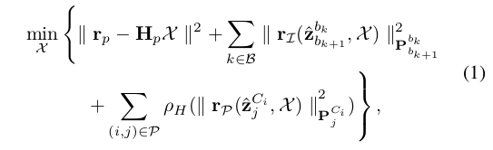
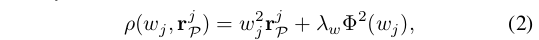
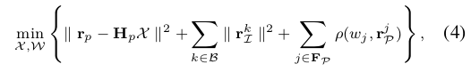
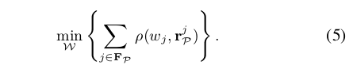
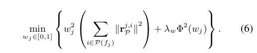
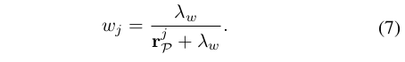
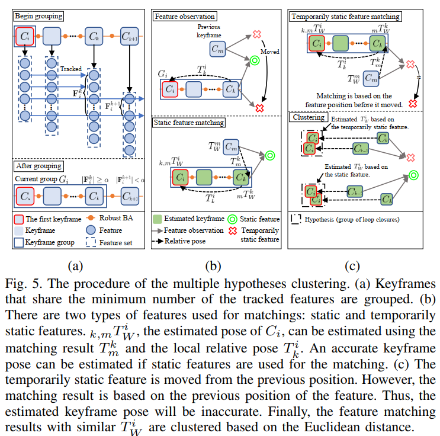

# DynaVINS

[TOC]

## Abstract

​	视觉惯性里程计和 SLAM 算法广泛应用于各个领域，例如服务机器人、无人机和自动驾驶汽车。大多数 SLAM 算法都基于地标是静态的假设。然而，在现实世界中，存在各种动态对象，它们会降低姿态估计的准确性。此外，暂时静止的物体，在观察期间是静止的，但在看不见时会移动，会触发误报闭环。为了克服这些问题，我们提出了一种新颖的视觉惯性 SLAM 框架，称为 DynaVINS，它对动态对象和临时静态对象都具有鲁棒性。在我们的框架中，我们首先提出了一个强大的BA，它可以通过利用 IMU 预积分估计的姿势先验来拒绝来自动态对象的特征。然后，提出了关键帧分组和基于多假设的约束分组方法，以减少闭环中临时静态对象的影响。随后，我们在包含大量动态对象的公共数据集中评估了我们的方法。最后，实验结果证实，与其他最先进的方法相比，我们的 DynaVINS 通过成功拒绝动态和暂时静态物体的影响而具有可观的性能。

## Related Works

### B. Dynamic Objects Rejection in Visual and VI SLAM 

​	许多研究人员提出了各种方法来处理视觉和 VI SLAM 算法中的动态对象。 范等人。 [10] 提出了一种使用 RGB-D 相机的基于多视图几何的方法。 通过最小化重投影误差得到相机位姿后，通过相机运动与特征之间的几何关系确定每个特征点的类型是动态的还是静态的。 卡诺瓦斯等人。 [11] 提出了一种类似的方法，但采用了类似于多边形的面元，通过减少要计算的项目数量来实现实时性能。 然而，基于多视图几何的算法假设相机位姿估计足够准确，当相机位姿估计不准确时，由于主要的动态对象而导致失败。

​	该问题的解决方案之一是采用轮式编码器。 G2P-SLAM [19] 拒绝了与车轮里程计估计姿态的马氏距离较高的闭环匹配结果，这对动态和暂时静态物体的影响是不变的。 尽管车轮编码器具有优势，但这些方法高度依赖于车轮编码器，限制了它们自身的适用性。

​	另一种可行的方法是采用深度学习网络来识别预定义的动态对象。 在 DynaSLAM [9] 中，使用深度学习网络消除了预定义动态对象的掩蔽区域，其余部分通过多视图几何确定。 在动态 SLAM [20] 中，采用补偿方法来弥补使用序列数据在几个关键帧中的漏检。 尽管深度学习方法可以成功丢弃动态对象，即使它们是暂时静态的，但这些方法存在一些问题，原因有以下两个：a）必须预先定义动态对象的类型，以及 b）有时，只有一部分 动态对象是可见的，如图 1(b) 所示。 由于这些原因，有时可能无法检测到对象。

​	另一方面，已经提出了用于跟踪动态对象运动的方法。 RigidFusion [12] 假设环境中只有一个动态对象，并估计动态对象的运动。 邱等人。 [14] 结合深度学习方法和 VINS-Mono [3] 来同时跟踪相机和物体的姿势。 DynaSLAM II [13] 识别动态对象，类似于 DynaSLAM [9]，然后在 BA 因子图中，估计静态特征和相机的位姿，同时估计动态对象的运动。

## III. Robust Bundle Adjustment

### A. Notation

​	定义一些符号：
$$
C_i——第i个 camera \ \ frame\\
f_j——第j个跟踪到的特征\\
T_B^A\in SE(3)——pose \ of \ C_A \ relative \ to \ C_B \ (C_A相对于C_B的位姿) \\
T^A_W——C_A在世界坐标系下的位姿
$$
​	在当前滑动窗口的视觉惯性优化框架中，X 表示包含关键帧的姿态和速度集、IMU 的偏差（即加速度和陀螺仪偏差）以及估计的特征深度的完整状态向量，如 [3]。

### B. Conventional Bundle Adjustment(传统BA)

rou为鲁棒核函数。这里的目标函数与VINS的一致。

​	另一方面，重新下降的 M 估计器，例如 Geman-McClure (GMC) [24]，由于其零梯度，一旦残差超过特定范围，就会完全忽略异常值。但是这个方法会认为静态点也是外点。

​	*有关GMC：https://zhuanlan.zhihu.com/p/494343423*

​	**为了解决这些问题，我们的 BA 方法由两部分组成：a）利用 IMU 预积分的正则化因子和 b）用于考虑每个权重的先前状态以涵盖预积分暂时不准确的情况的动量因子。**

### C. Regularization Factor

​	首先，为了在稳健地估计姿势的同时拒绝异常值特征，我们提出了一个受 B-R 对偶性 [21] 启发的新损失项，如下所示：

rjp表示视觉残差模的平方，wj [0,1]是每个特征的权重。wj越接近1表示其是静态点。lambda w是常数，正实数。phi(wj)表示权重正则化因子：
$$
\Phi(w_j)=1-w_j
$$
这个rou代替了公式（1）中的鲁棒核函数。因此，目标函数变为：

其中，W={wj|j $$\in$$ F_p }，代表所有权重的集合。

​	通过采用受 B-R 对偶启发的权重和正则化因子，可以在保持状态估计性能的同时，减少与估计状态相比具有高重投影误差的特征的影响。 详细信息将在本小节的其余部分中介绍。

​	(4) 使用交替优化来解决[21]。 因为当前状态 X 可以从 IMU 预积分和先前优化的状态中估计出来，与其他方法 [17, 18] 不同，W 首先用固定的 X 更新。 然后，用固定的 W 优化 X。

​	当优化W时，其他变量均可视为常数，因此优化权重方程变为：

由于式(6)中有关wj的是二次项，因此最优化解wj可以推导出来：

​	如前所述，**权重首先根据估计的状态进行优化。 因此，具有高重投影误差的特征的权重从较小的值开始。** 

​	然而，如图 3(a) 所示，特征 ρ(w j , r j P ) 的损失是一个凸函数，除非权重为零，并且内点外点的损失函数rou中都存在非零梯度部分，这意味着新特征首先会影响 BA，而不管类型如何。

​	 虽然重复优化步骤直到状态和权重收敛，但异常值特征的权重会降低，并且它们的损失更加平坦。 结果，异常值特征的损失接近零梯度，不会影响BA。

## IV. SELECTIVE GLOBAL OPTIMIZATION 

​	在典型的视觉 SLAM 中，所有闭环都被利用，即使其中一些来自临时静态对象。 那些误报闭环可能会导致 SLAM 框架的失败。 此外，来自临时静态对象和来自静态对象的特征可能存在于同一关键帧。 因此，在本节中，我们提出了一种在保持真正环闭包的同时消除假正环闭包的方法。

### A. KeyFrame Grouping

​	与单独处理闭环的传统方法不同，在本研究中，来自相同特征的闭环被分组，即使它们来自不同的关键帧。 因此，每组只使用一个权重，从而可以更快地进行优化。

