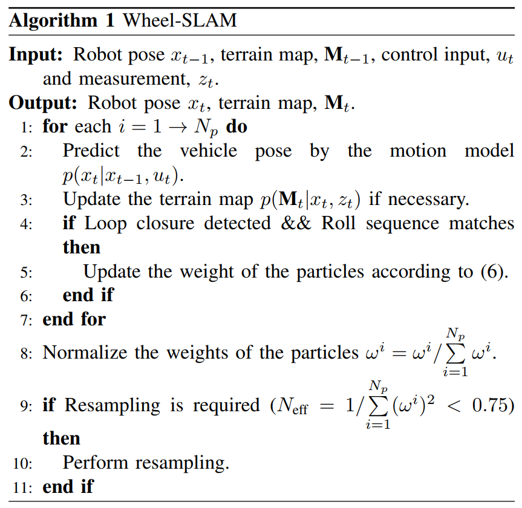
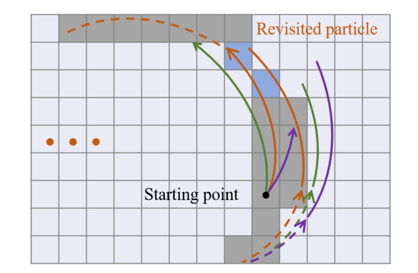
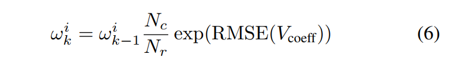

# WheelSLAM

## III. Methodology

### A.Background

​	Wheel-INS [1] 是 Wheel-SLAM 的基础。 它用于提供机器人里程计和滚动角估计。 Wheel-INS有两大优势。 首先，可以通过陀螺仪输出和车轮半径计算车轮速度，从而实现与仅使用一个 IMU（没有其他传感器）的 ODO/INS 相同的信息融合。 其次，它可以利用旋转调制来限制 INS 的误差漂移

### B. Dynamic Bayesian Network

​	Wheel-SLAM 使用 PF 来估计机器人轨迹分布。 对于每个粒子，单独的基于轨迹的地形图是相互独立的。 结果，每个粒子都由机器人姿势和地形图组成； 因此，时间 t 的第 i 个粒子可以表示为
$$
X^t_i=[x_i^t  \ \ \ \ \ M_i]
$$
​	Wheel-SLAM 算法包括四个主要步骤： 1）通过运动模型采样新的机器人状态； 2）更新地形图； 3）一旦报告了确信的闭环，就更新粒子权重； 4) 必要时重新采样粒子

#### Step1 :

The first step is to generate a new pose for each particle bysampling from the robot probabilistic motion model: 
$$
p(x_t|x_{t-1},u_t)
$$
这意味着机器人姿态 xt 是机器人控制 ut 和先前姿态 xt−1 的概率函数。 在这里，我们采用 Wheel-INS 来预测机器人状态。

### C. Grid Terrain Map Construction

网格地图构建和重访识别的说明。 不同颜色的曲线代表不同粒子采样的机器人路径。 机器人已经访问过灰色网格，因此它们具有路堤角度估计。 一旦粒子检测到机器人连续返回访问过的网格（蓝色），就会报告潜在的闭环以供进一步检查（请参阅第 III-D 节了解详情）。

### D. Particle Weight Update

​	一开始，所有的粒子都被分配了相同的权重。 当机器人运动时，每个粒子都有不同的轨迹和地形图。 为了确保闭环的可靠性并减少异常值的影响，我们设置了三个标准。 首先，需要在长度为 Nr 的窗口中通过机器人位置连续检测闭环。 其次，我们使用 Pearson 相关系数 [19] 计算 Nr 滚动序列匹配分数，并将它们与阈值 Cthr 进行比较。 在这个Nr窗口中，至少有Nthr（Nthr <= Nr）个系数需要大于Cthr。 第三，当前位置的相关系数需要大于阈值。 如果满足所有三个要求，我们认为这是一个真正的闭环并随后更新粒子权重如下：

​	其中 k 表示时间步长； i 表示粒子数； Nc（Nc≥Nthr）为窗口Nr中大于阈值的相关系数个数； RMSE表示均方根误差； Vcoeff 是窗口中大于阈值的相关系数的集合。 之后，执行归一化以使权重之和等于一。

​	请注意，尽管 Wheel-SLAM 需要对机器人进行精确的重新访问，但车辆并不需要始终在同一条道路上行驶。 当机器人探索未知环境时，位置误差会累积，但一旦机器人回到先前访问过的道路上，它就可以得到纠正。 实验结果和讨论请参考第四节。 此外，由于我们的算法需要一系列路堤角度进行匹配，因此无法在机器人可能进入垂直于其最后进入方向的地方的十字路口有效地检测闭环。

