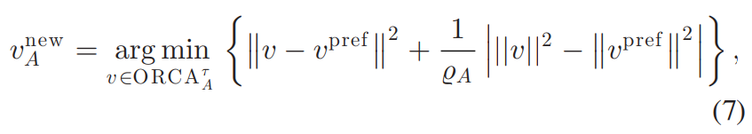
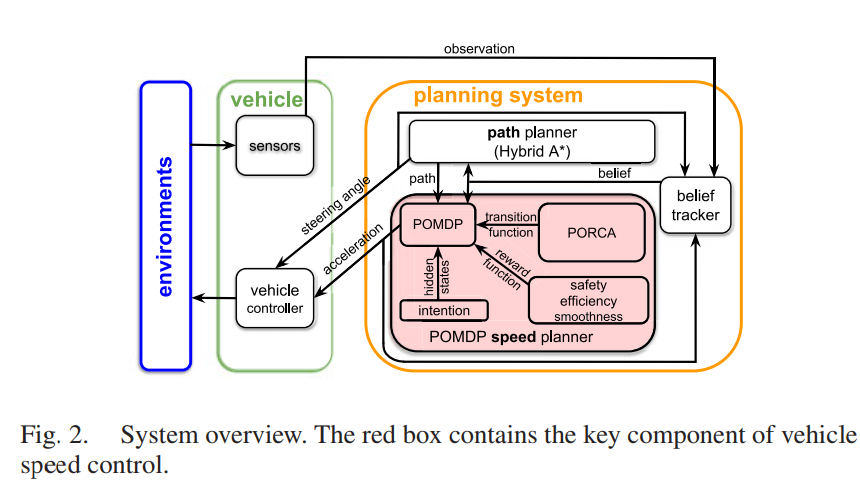

# PORCA

## Abstract

​	介绍了一个在许多行人中自动驾驶的规划系统。我们方法的一个关键要素是行人最优相互碰撞避免，这是一种行人运动预测模型，它考虑了行人的全局导航意图以及与车辆和其他行人的局部交互。不幸的是，自动驾驶汽车不能先验地知道行人的意图，并且需要一种规划算法来对冲行人意图的不确定性。我们的规划系统将部分可观察马尔可夫决策过程算法与行人运动模型相结合并实时运行。实验表明，它使机器人滑板车能够在密度接近每平方米一人的人群中安全、高效、平稳地行驶。 

## 概述

​	图 2 显示了我们的驱动系统的概述。它由信念跟踪器、路径规划器和速度规划器组成。信念跟踪器保持对行人意图的信念并不断更新它以整合新的观察结果。路径规划器使用混合 A* [24] 来规划非完整驾驶路径，并从路径中提取车辆转向命令 

​	速度规划器求解意图 POMDP 模型以控制沿规划路径的车辆速度。规划系统以 3HZ 重新规划转向和速度。 

​	这项工作的重点是构建速度规划器，以实现行人之间的意图和交互感知自动驾驶；我们将读者推荐给[10]以获取有关路径的更多详细信息 。

​	图 2 中的红框显示了我们的速度规划器的详细视图。 我们构建了一个 POMDP 模型，将行人意图编码为隐藏状态。 在每个时间步，速度规划器在信念树中执行前瞻搜索，使用行人运动模型 (PORCA) 来预测行人行为。 然后，车辆执行计划中的第一个动作，该动作针对许多行人的安全、高效和平稳驾驶进行了优化

### III ORCA

https://www.meltycriss.com/2017/01/14/paper-orca/

局限：

​	冻结行人：ORCA 的目标函数 (6) 试图最小化从新的无碰撞速度到行人首选速度（指向他/她的目标位置）的距离。 这有时会导致行人模拟中的“冻结行人”问题。 行人坚持朝着他们的目标方向行走，导致他们走得很慢，甚至在途中受阻时保持静止。 然而，现实中的行人希望保持他们的速度（速度的大小）并在这种情况下绕开障碍物进行必要的绕行。 有关此问题的示例，请参见图 4

​	违反非完整约束：ORCA 假设智能体的运动是完整的，智能体可以灵活地改变它们的移动方向以避免碰撞。 对于行人来说确实如此。 然而，现实中的大多数车辆都处于非完整运动学约束下，不能自由改变方向。 在对车辆进行完整假设的情况下，ORCA 中的行人将在相互避碰过程中对车辆的运动有错误的预期。 这通常会导致对行人的不自然模拟。

## IV 行人预测

​	有耐心的目标函数：冻结行人问题可以通过几种方法来解决，例如在 ORCA 中执行多步前瞻，或者应用全局规划器来重新规划行人的首选速度。 然而，这些方法会显着增加 ORCA 的计算时间，因此不适合我们的应用，因为 ORCA 将在每个规划周期中大量使用。 在本节中，我们提出了一种计算开销相当低的冻结行人问题的解决方案。

	其中变量 A ∈ (0, 1] 衡量行人 A 的耐心。我们观察到，行人通常更喜欢保持当前速度。如果他们打算移动，他们在原地不动或走路时往往会越来越不耐烦 非常慢。因此，我们在（7）中引入第二项来惩罚行人的意外减速。我们使用行人的耐心程度来控制这种惩罚的强度。直观地，如果行人以低速行走，则得到 随着时间的推移越来越不耐烦（减少）。权重对于（7）中的第二项，然后增加并鼓励行人探索使他/她能够更快移动的替代方向

​	

​	职责不断变化的 ORCA：为了处理车辆的非完整运动并产生更自然的行人与车辆交互，当行人非常靠近车辆时，我们让行人承担更多避免相互碰撞的责任。 车辆相应地承担更少的责任。 对于车辆，该机制选择更接近其当前速度的速度，从而更好地遵守非完整约束。 对于行人，它模拟了他们避免与非完整车辆发生碰撞的紧迫性。

​	行人运动模型将行人和车辆的意图作为输入，并模拟它们的交互以预测行人运动。 我们改进了 ORCA [1]，一种基于相互防撞的行人模拟算法，以模拟更自然的行人-车辆和行人行人交互。
​	为了完整起见，我们将首先介绍 ORCA 及其局限性，然后介绍解决这些局限性的模型

