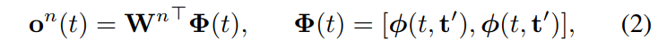

	摘要 对于人类和机器人在动态环境中共存的关键是智能体理解彼此的动作
并预测他们的动作的能力。本文介绍了随机过程预期导航 (SPAN)，该框架使非完整机器人能够在拥挤的环境中导航，同时预测和解释行人的运动模式。为此，我们学习了一个预测模型来预测连续时间随机过程，以模拟行人未来的运动。预期的行人位置用于进行机会约束碰撞检查，并被纳入碰撞时间控制问题。还集成了占用图，以允许对静态障碍物进行概率碰撞检查。我们展示了 SPAN 在拥挤的模拟环境中的能力，以及真实世界的行人数据集 

​	**我们提出了随机过程预期导航 (SPAN) 框架，该框架生成局部运动轨迹，该轨迹考虑了对动态对象的预期运动的预测。** 

​	为了满足这些要求，我们将不确定的未来运动表示为连续时间随机过程。
我们的表示捕获了预测的不确定性，并且可以在任意时间分辨率下进行评
估。我们训练一个神经网络预测随机过程的参数，以观察到的行人在环境中的运动为条件。

​	SPAN 在将行人运动和静态障碍物的数据驱动概率预测联合集成到控制问题公式中是新颖的。本文的技术贡献包括：（1）行人未来的连续随机过程表示，与神经网络兼容，并允许以灵活的分辨率进行快速的机会约束碰撞检查； (2) 制定控制问题，利用预测的随机过程作为预期的未来行人位置，在人群中导航。 

## VI

​	在本节中，我们介绍了未来行人运动的连续随机过程表示，并概述了该表示如何集成到神经网络学习模型中。

​	未来行人位置的表示需要捕捉不确定性。 此外，行人位置预测的时间分辨率需要与碰撞检查的频率同步。 这些因素促使对未来行人位置使用连续时间随机过程 (SP)。 SP 可以被认为是函数的分布。 此外，连续性允许查询未来行人位置在任意时间，而不是在固定分辨率下，无需额外的在线插值。

​	我们首先考虑确定性的行人运动轨迹，然后扩展到运动轨迹上的分布。 轨迹由连续时间函数建模，给出为 m 个基函数的加权和。

第n个行人

W是权重，Φ包含两个基函数评估向量，其是 m 个等距时间点的基函数评估向量。基函数：
$$
\phi(t,t')=e^{-\gamma||t-t'||^2}
$$
其中 γ 是长度尺度的超参数。

​	为了将我们的表示从单个轨迹扩展到未来运动轨迹的分布，我们假设权重矩阵不是确定性的，而是随机的，具有矩阵正态 (MN) 分布：

### B. 结合强化学习

​	本小节概述了如何训练模型来预测行人运动的 SP 表示。 在下面的小节中，我们将权重矩阵表示为 W，将矩阵正态分布的参数表示为 M； U; V，不参考特定行人的障碍物指数。 我们的目标是以最近观察到的行人位置的短序列为条件，直到现在的{o1 ,...,op}并预测 M； U; V，它定义了此后运动的 SP。 使用收集的数据离线训练预测模型，然后在线查询。

