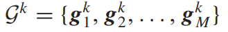
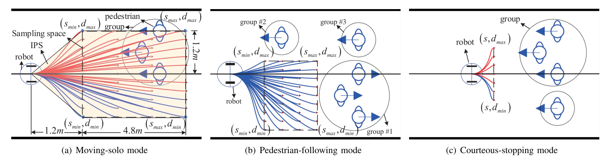
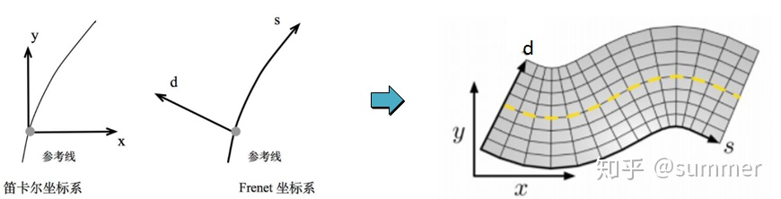

# A Unified Multiple-Motion-Mode Framework forSocially CompliantNavigation in Dense Crowds 

​	在将行人标记为组之后，我们将讨论它们的特征。 为方便起见，我们用元组表示组的状态
$$
g_m=(p_m,v_m,p_{rm})^T\\
其中p_m=(p_{mx},p_{my})^T\\
v_m=(v_x,v_y)^T
$$
pm是位置，vm是速度，prm是半径。

我们使用序列表示在时间步 k 时人群中获得的 M 组的状态：

其中，
$$
g_m^k=(p_m^k,v_m^k,p^k_{rm})^T
$$
是群m在k时刻的状态。

​	为了预测一个群体的轨迹，我们使用了等速模型（CVM）。 尽管存在其他更复杂的模型，例如 Social-LSTM [29]，但 CVM 在实践中更可取，因为它具有三个优点。 首先，CVM 假设该组在每个时间步以恒定速度向前移动。 这意味着行人的运动应该不受机器人存在的影响，从而提示机器人主动避开行人。 其次，CVM 是无参数的，因此它适用于许多不同的环境。 第三，CVM的计算复杂度低。 因此，CVM 适用于带有板载计算单元的移动机器人。 在 [30] 中验证了在密集人群中基于 CVM 的轨迹预测的性能与其他最先进的算法相比具有竞争力

​	在时间步 k 开始时，该时间间隔内的预测步行距离为

Δmk是行走距离。因此，轨迹估计表示为：

​	首先，为了满足在不发生碰撞的情况下尽快到达目的地的要求，采用全局路径建立点阵采样策略。所提出的策略生成的候选轨迹是基于全局路径的，因此这些轨迹可以引导机器人通过尽可能沿着全局路径移动来有效地到达目的地。其次，为了满足高效计算的要求，采用点阵采样策略，在模拟行人步行行为的同时，广泛分散候选轨迹。候选轨迹需要分开，因为几乎相同的轨迹可能会与相同的障碍物相交。因此，如果两条轨迹不必要地彼此靠近，这将是一个糟糕且低效的选择。第三，为了生成满足机器人运动学约束的轨迹，我们使用闭环控制律在时间步k 处生成机器人初始状态xk和采样终端状态xk之间的轨迹 

### frenet坐标系

https://zhuanlan.zhihu.com/p/109193953

​	笛卡尔坐标系的替代解决方案为 Frenet 坐标系，Frenet 坐标系描述了汽车相对于道路的位置，在 Frenet 坐标系中，s 代表沿道路的距离称为纵坐标，d表示与纵向线的位移称为横坐标。

​	这样保证了在道路的每个点上，横轴和纵轴都是垂直的，纵坐标表示在道路中的行驶距离，横坐标表示汽车偏离中心线的距离。

### 三、候选轨迹抽样策略 

​	在本节中，我们建议模仿行人的步行行为，为机器人导航自然选择合适的运动模式，从而将符合社会要求的导航制定为轨迹优化问题。我们基于社会惯例为不同的运动模式构建候选轨迹采样策略 

#### A. 移动独奏模式 

​	利用IPS确定参数Qk。黄色的五边形是 IPS，然后我们可以在 IPS 的虚线矩形中对候选局部终端状态进行采样。

#### B. 行人跟随模式 

​	在行人跟随模式下，机器人模仿行人的行走行为跟随领导者从集体运动中受益。在这种模式下，关键角色是领导者，可以是个人，也可以是团体。在人群密集的情况下，一般情况下有多个群体，评估群体的好坏很重要，可以从中选出一个最好的领导者。本文从以下几个方面来评价一个组的好坏。

​	组的好坏：

​	第一个特点是慢。移动太慢的群体不适合被选为领导者。我们忽略移
动速度低于 0.3 m/s 的组，并将剩余的组设置为候选领导者 

​	第二个特征是运动方向的相似性。 我们需要评估机器人和所有组的运动方向的相似性，然后确定领导者 。

​	第三个特点是最小切换。可能会发生多个组是满足上述标准的候选领导者。由于在不同领导者之间频繁切换时可能会引起振荡运动，因此如果它在众多候选人中，则保持一个群体的领导地位更合理。如果上一个时间步的领导者当前不是候选领导者，我们从候选领导者集合中选择具有最小θm 的领导者 

#### C. 礼貌停车模式 

​	在礼貌停车模式下，机器人模仿小人的行走行为，本应放慢甚至停下来为团体、老年人或残疾人让路。因此，采样空间应小于其他运动模式下的采样空间，同时考虑机器人的运动学约束。我们将时间步k的采样参数设置为Qk = {1.2, 1.2, ‑0.5, 0.5}，如图 3(c) 所示。我们随机生成了一组 7 个候选终端状态，用Sk表示 

### 轨迹选取策略

​	第一个指标是进度。 由于机器人的主要任务是移动到预先指定的目的地 x F，因此更优选机器人在每个时间步都尽可能地移动。 在本文中，我们提出了度量进度，以测量机器人沿每个候选轨迹移动的距离。 给定局部轨迹在第 k 次的进度可以表示为

