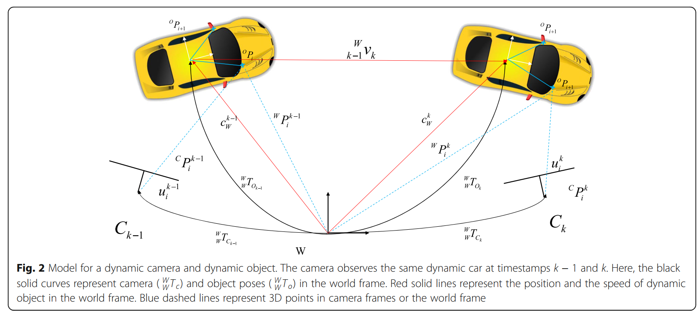
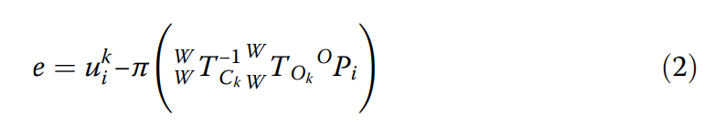

[TOC]

There are two methods for solving this problem. The first is culling dynamic features/correspondences as outliers, which is known as the robust SLAM problem (Robust sections). The second method is integrating SLAM and multiple object tracking (MOT), which is known as the SLAMMOT problem (SLAM MOT sections) 

有两种方法可以解决这个问题。 第一个是将动态特征/对应关系剔除为异常值，这被称为鲁棒 SLAM 问题（鲁棒部分）。 第二种方法是整合 SLAM 和多目标跟踪（MOT），这被称为 SLAMMOT 问题（SLAM MOT 部分）

**Existing surveys on dynamic SLAM or its components** 

我们只讨论基于特征点以及特征点线的SLAM。

为了匹配准确，基于点的SLAM我们基于描述子特征匹配。但是这在动态SLAM中效果不佳。Most existing systems utilize optical flows to address this problem （用光流解决）

Based on the development of hardware and deep learning, designing extractors and feature matching systems using data-driven methods has attracted基于硬件和深度学习的发展，使用数据驱动方法设计提取器和特征匹配系统引起了广泛关注 significant attention 

The implementation details of low-level-feature-based dynamic SLAM will be discussed from two perspectives : culling dynamic features (including point and point-line features, Robust SLAM section) or leveraging them (major focus on point features, SLAM MOT section). 

基于低级特征的动态SLAM的实现细节将从两个角度讨论：剔除动态特征（包括点和点线特征，**Robust SLAM部分**）或利用它们（主要关注点特征，**SLAM MOT部分**） .

### Low-level-feature-based Dynamic SLAM

#### Robust SLAM

To cull dynamic features properly, robust SLAM must distinguish between dynamic and static features, which is known as motion segmentation 

为了正确剔除动态特征，鲁棒的 SLAM 必须区分动态和静态特征，这被称为运动分割

**方法：分类为光流法、几何方法以及基于运动的方法。optical flow methods, geometric methods, and motion-based methods **

##### 光流法：

​	Optical flows depict the kinematics of features in a 3D space based on the kinematics of their projections in a 2D image space.光流基于特征在 2D 图像空间中投影的运动学来描述 3D 空间中特征的运动学。

​	An intuitive approach is to estimate the camera ego motion first and then use the optical flow between the predicted and measured images to detect moving objects动态SLAM中，相机和物体均会运动。一种直观的方法是先估计相机的自我运动，然后使用预测图像和测量图像之间的光流来检测运动物体。 不过这么做不完美。

​	Zhang et al. [23] proposed a method to overcome this difficulty by estimating the camera ego motion using depth and intensity information in a coarse-to-fine scheme.张等人。 [23] 提出了一种方法来克服这一困难，方法是使用粗到细方案中的深度和强度信息估计相机自我运动。先得到相机运动，再估计运动物体。

​	对于线特征，Faugeras et al. [66] presented a complete description of the relationship between the 3D and 2D motion of lines 与点特征的光流相比，直线光流由二维线和相机光学中心定义的平面的法线的时间导数表示。 该方法已用于多运动分割[67]和3D检测[68]。 然而，到目前为止，它还没有被用于动态 SLAM。

##### 几何法：

​	这些方法为静态数据关联设置具有几何约束的阈值，以检测动态特征。（可以理解为：超过阈值即为动态）。

​	利用极限约束、重投影等关系。

​	对于点特征，约束可以从核线方程[69]、反投影射线（三角测量）[70]、相机姿态[71]估计或重投影误差[72]推导出来。 首先，假设所有特征都是静态的。 在此假设下，可以估计核线、3D 地标位置（最小二乘解）、相机姿势或投影。 然后，可以计算估计和测量之间的误差，并根据预设阈值检测动态特征。 Saputra 和 Trigoni [16] 彻底讨论了点特征的几何方法。 这类方法的核心如图 1a 所示。

​	**对于线特征**，Zhang 等人。 [25] 使用 RGB-D 相机检测动态线特征。 可以使用 RGB-D 相机捕获的深度信息在当前帧中重建与图像中的线条对应的 3D 地标的结构。 他们使用静态点特征来获得初始相机运动。 然后可以使用初始变换预测新帧中线条的姿态。最后，他们定义了匹配和预测的 3D 线之间的距离，如图 1b 所示，并用它来检测动态线特征。 对于基于点的 SLAM，提出了线特征的重投影误差，并已在许多基于点线的 SLAM 系统中用于优化 [67, 73]。 然而，这种几何信息很少用于运动分割。 为了避免通过动态线特征检测将额外的计算引入基于点的动态 SLAM，通常使用深度 [25] 或语义信息 [74]。 与重投影误差相比，这种类型的信息可以提供更可靠的约束

**基于运动的方法：**

​	利用了相机运动可以约束静态特征的事实。 IMU 提供的自我运动信息可以轻松区分静态特征和动态特征。 这是因为只有静态特征符合 IMU 信息。 此外，这种方法可以与上面讨论的两种方法结合使用。 金等人。 [75] 使用 IMU 来补偿连续图像之间的旋转，然后计算运动矢量。 这些动态特征随着传感器的运动表现出不同的趋势，根据阈值进行过滤。 据我们所知，没有利用 IMU 信息的基于点线的动态 SLAM 方法。 然而，可以通过稍微修改基于点和线特征的视觉惯性里程计系统来建立这样的系统[73]。

​	To the best of our knowledge, there are no point-linebased dynamic SLAM method utilizing IMU information. 

不过，我们可以将其建立在VIO based point and line系统上面

**讨论：**

​	表2列出了最近的系统。对于基于点的鲁棒SLAM，几何方法可以在没有其他先验的情况下分割特征，但是单独使用一个几何阈值总是会导致运动退化的问题。 例如，基于核线的阈值无法检测沿核线移动的动态特征。 相比之下，基于运动的方法可以轻松解决运动退化问题。 光流方法可以在没有其他先验的情况下在 2D 空间中分割。 但是，它们对光照条件很敏感。 因此，结合上面讨论的两种或三种方法是一种很有前途的替代方法。 当检测到静态特征时，可以使用标准 SLAM 系统（包括直接 SLAM [76] 和间接 SLAM [77]）来估计相机自我运动并重建周围场景的地图。

​	尽管基于点线的 SLAM 已被证明可以提供准确和稳健的结果，但很少有研究关注其对动态环境的扩展，因为它的计算负担高且性能改进相对较低。 但是，线要素在拥挤的走廊和楼梯等特殊的动态环境中仍然占有一席之地。 因此，探索一种更有效的线特征提取和匹配方法对其在动态场景中的应用具有重要意义。

​	此外，仅在少量连续帧中检测动态分量并不稳健，因为上述方法无法根据短期观察区分具有噪声和缓慢移动特征的测量值。Du et al. [22] tackled this problem by constructing a probabilistic model and detected dynamic features using conditional random fields (CRFs) with long-term observations, which guaranteed the long-term consistency of maps 

​	**遮挡问题：**谭等人。 [24] 基于相机的特征和运动信息的外观检测遮挡。 他们保存了那些很少观察到的地标，以对抗遮挡并提高系统的鲁棒性。

#### SLAMMOT

​	基于低级特征的 SLAMMOT 有两个核心模块：多运动分割和 3D 对象跟踪与重建。 多运动分割的输入可以是全部对应，也可以只是动态对应。 输出是与运动标签对应的集群，用作 3D 对象跟踪和重建的输入。 第二个模块的输出是摄像机和动态对象的轨迹，以及静态环境和动态对象的结构。 虽然张等人。 [67]提出了一种基于线特征执行多运动分割的方法，没有动态SLAM系统跟踪线特征。 因此，讨论了一种基于点的方法来解决这个问题。

##### Multi-motion segmentation 多运动分割

The premise of using dynamic features in SLAM system is to classify them according to their motion state, which is known as multi-motion segmentation. The same motion label is assigned to features that belong to the same Xu et al. Visual Computing for Industry, Biomedicine, and Art (2021) 4:20 Page 6 of 16 cluster. This process can be performed using subspace clustering methods or motion model-fitting methods. 

在 SLAM 系统中使用动态特征的前提是根据它们的运动状态对它们进行分类，这就是所谓的多运动分割。 相同的运动标签被分配给属于同一个 Xu 等人的特征。 工业、生物医学和艺术的视觉计算 (2021) 该过程可以使用子空间聚类方法或运动模型拟合方法来执行。

**Subspace clustering methods: **

​	子空间聚类方法：在考虑仿射相机模型时，单个刚体运动的跟踪特征点的轨迹都将位于最多四个维度的线性子空间中。 因此，多运动分割问题可以被认为是一个子空间聚类问题[78]。 将点分配给适当的子空间和估计子空间参数应该同时进行。 张等人。 [79]提出了一种排列空间的聚类方法。

​	首先，最初的假设是通过随机抽样产生的。 然后提取点的排列偏好并将其用于链接聚类。 通过随机抽样每个集群产生新的假设。 这种采样和聚类过程是迭代进行的，直到实现收敛。 基于这种聚类方法，Wang 等人。 [44] 构建了一个不使用语义线索的动态 SLAM 管道。 此外，有效的降维可以提高子空间集群的性能。 例如，TMPCA [80] 是一种有效的数据降维技术。 因为它使用的参数数量少于基于神经网络 (NN) 的模型，所以它需要的计算量相对较少，这对于确保实时性能很重要

**Motion model fitting methods: **

​	运动模型拟合方法：在某种程度上，运动模型拟合方法是子空间聚类方法的一种特殊形式。 与子空间聚类方法不同，运动模型拟合方法直接估计特征对应的运动矩阵。 运动模型的类型包括基本矩阵、仿射基本矩阵、基本矩阵、单应性/投影性和亲和性。

​	符合相同运动模型的对应被分组到集群中。 贾德等人。 [45] 提出了一种用于 3D 传感器（立体相机、R-GBD 相机或激光雷达）的运动模型拟合方法。 他们首先进行数据关联，并为每个特征点形成世界和图像空间轨迹历史。 这些轨迹可以根据观察到的运动进行分割，这是一个多标签问题。

##### Dynamic feature reconstruction and 3D object tracking 动态特征重建以及3D目标跟踪

​	如图所示，刚体上的第 i 个点，记为 OPi，在不同时间戳的对象坐标系中具有相同的坐标。

​	这种公式可以联合优化相机 (W WTCk ) 和移动物体 ( W W TOk ) 的姿势，以及它们的 3D 点的位置 [48]。 

​	变换的左下标（从哪个坐标系）转换到右下标（坐标系），左上标（在哪个坐标系下的表示）。

​	这个公式：在物体坐标系上的Pi，转换到世界坐标系，再转换到相机坐标系。利用重投影误差可以优化物体位姿和相机位姿。[48]

​	对于立体相机或RGB-D相机，动态点的深度可以在当前帧中获得。因此，可以很容易地估计刚体的运动。与静态场景中的标准 SLAM 不同，Bescos 等人。 [48] 使用方程式。 (2)建立紧密耦合的多目标跟踪和SLAM系统。张等人。 [51+82]通过向因子图中加入新约束(等式4)构建静态SLAM。通过这种方式，他们在不使用该物体姿势的情况下估计了一个刚性物体的运动。同样，王等人。 [44] 利用立体相机。具体来说，他们直接使用相机坐标系中表示的点坐标，而不是世界坐标系中表示的点坐标。他们估计了相机相对于静态和移动物体的运动。然后，通过将相机运动、相机运动相对于运动物体的反演以及物体中心的初始位姿相乘来获得物体运动。

​	对于单目相机，运动物体的重建是一项不平凡的任务。 重构和跟踪处理有两个主要困难。 首先，标准三角剖分不适用于动态特征，因为反投影光线不相交。 其次，运动物体的估计轨迹是不明确的，并恢复为相对于相机轨迹的单参数轨迹族，这被称为相对尺度模糊问题 [83, 84]

​	讨论：优化摄像机和移动物体的轨迹有两种主要方法。 一种称为分离或松耦合方法，首先优化相机位姿，然后优化动态对象位姿。另一种是联合或紧耦合方法，它同时优化相机和动态物体的位姿。 与分离方法不同，联合方法可以在统一的坐标系中保持运动物体和相机的运动一致性。

​	**遮挡经常出现在 SLAMMOT 系统中**，与鲁棒 SLAM 系统（Robust SLAM section）相比，这个问题更难解决，因为相机和运动物体的估计轨迹可能会因为静态物体或其他物体的遮挡而漂移或丢失 移动物体。 此外，当丢失的对象再次出现时，如果没有实施特殊处理，则会为其分配一个新标签，从而导致称为标签不一致的问题。 一个通用的解决方案是利用历史信息并在此信息和当前观察之间建立关联。 黄等人。 [47] 根据遮挡期间的历史信息预测集群运动，并将其与重新检测到的观察相关联。 然后他们根据遮挡前后的信息恢复运动

Using high-level features in dynamic SLAM

### Using high-level features in dynamic SLAM 

​	与低级特征相比，每个高级特征对应于一类 3D 对象。 与点特征相比，高级特征更具辨别力，可以更轻松地处理低纹理场景[14]。 值得注意的是，高级特征不仅用于对象 SLAM（使用标记对象作为地图的元素），还用于基于点的 SLAM

​	图像空间中高级特征的表示包括 2D 边界框表示和逐像素掩码表示。 前者可以通过物体检测来提取。 后者可以使用逐像素语义分割来提取。 可以使用支持向量机 (SVM) [86]、CRF [87] 和 NN [88] 来实现高级特征检测器。 尽管目标检测领域的主流检测器最近都基于神经网络开发，但 SVM 方法仍然值得考虑，因为它计算量更轻，这对于实现实时动态 SLAM 性能很重要。

​	对于基于点的 SLAM，高级特征仅作为额外的先验。 因此，无需为高级特征完成数据关联。 然而，对于物体 SLAM，数据关联在物体姿态估计中起着重要作用。 高层数据关联的本质是MOT问题。 MOT的方法大致可以分为生成方法和判别方法。

​	目前主流的策略是判别法，通常也称为tracking-by-detection或detection based tracking。 该技术的主要流程由对象检测、外观建模、度量学习和数据关联四个模块组成。 关于外观建模，使用各种特征来描述对象，例如来自加速分段测试的特征（点特征）、光流（像素块）、颜色直方图（区域特征）或基于学习的特征

​	对于基于点的 SLAM，高级特征仅作为额外的先验。 因此，无需为高级特征完成数据关联。 然而，对于物体 SLAM，数据关联在物体姿态估计中起着重要作用。 高层数据关联的本质是MOT问题。 MOT的方法大致可以分为生成方法和判别方法。 目前主流的策略是判别法，通常也称为tracking-by-detection或detection-based tracking。 该技术的主要流程由对象检测、外观建模、度量学习和数据关联四个模块组成。关于外观建模，使用各种特征来描述对象，例如来自加速分段测试的特征（点特征）、光流（像素块）、颜色直方图（区域特征）或基于学习的特征。

​	它的主要任务是将特征映射到新的空间中，并使同一物体的特征在空间中更接近。 多对象关联的核心是最大后验问题，可以使用 CRF、二分图匹配或最小成本最大流网络流来解决。 此外，可以使用基于过滤器的方法预测边界框位置，并使用交集而不是并集来匹配结果。

​	值得注意的是，相同的低级特征，例如点特征，可以在 SLAM 和 MOT 中使用。 这意味着 MOT 可以嵌入到标准的 SLAM 框架中。通过利用外观模型中的特征，可以将高级数据关联重新组合为基于低级特征的方法和基于学习的方法。

​	**基于低级特征的关联方法：**可以基于具有相同标签的低级特征建立高级关联。 在边界框表示方面，需要额外的信息（例如轨迹和深度）来确保点和对象之间的对应关系是有效的，因为边界框总是包含位于背景和前景中的特征。Yang and Scherer [14] constructed an object SLAM system utilizing ORB SLAM2. **对于静态对象特征**，他们首先将点特征与其对应的高级特征相关联（点对象关联）。 然后，如果它们共享足够的点特征，它们会在不同帧中匹配高级特征。**Point-object associations should be constructed when points belong to an object**。因此，简单的边界框约束是不够的。 作者添加了约束条件，即点应在 2D 边界框中至少观察两帧，并且它们应足够靠近 3D 框中心。**该方法与上述 MOT 管道不同**，因为它利用相机位姿来隐式地引导高级关联。 但是，边界框重叠区域存在歧义。 此外，当物体静止或缓慢移动时，基于描述符的方法表现良好，但难以跟踪图像空间中快速移动的地标。**黄等人。 [47]** 精心建立了一个概率模型来探索快速移动对象的增强点-对象关联。 他们提出了一种结合语义、空间和运动信息的异构 CRF，以将特征与地标和边界框与集群联合起来，然后实现 KuhnMunkres 算法以将当前集群与之前的集群进行匹配。**对于逐像素分割表示，必须为掩码中的每个像素分配一个标签。 王等人。** [44] 在超像素级别完成了这一过程。 每个超像素都标有相应点特征的标签。 K-最近投票方法用于不包含标记点特征的超像素。

​	**基于学习的方法：**Li et al. [89] 提出了一种用于自动驾驶的 3D 对象检测方法。 他们直接利用神经网络来检测立体图像对之间的对应对象。 他们方法的关键要素是分配左右地面实况 (GT) 框的并集（称为并集 GT 框）作为对象分类的目标。 此外，在他们随后的工作 [90] 中，该概念被应用于执行相邻帧之间的数据关联。 这种方法在物体运动缓慢时可以很好地工作，保证了相邻帧中的边界框之间有足够的联合区域。 但是，它不能处理快速移动的物体。 此外，该方法基于其简单的匹配过程不能很好地处理遮挡。 戈登等人。 [53]根据长短期记忆[91]的特点，设计了一种可以更好地处理临时遮挡的网络。

#### Robust SLAM 

##### Using high-level features as semantic priors for low-level feature-based SLAM 使用高级特征作为基于低级特征的 语义SLAM 的先验

​	高级特征可以指导低级特征的运动分割。 语义可以提供表示特征动态概率的先验。 然而，单独使用语义标签来定义潜在的动态对象是无效的。**例如，**这种方法无法正确分类个人携带的书籍或椅子，因为从语义的角度来看，书籍和椅子通常是静态的。**因此，**应使用附加信息来检查每个特征的鲁棒运动分割。

​	**对于边界框中的背景点**，Ai 等人。 [34] 仅利用语义信息，构建了动态特征的概率模型，并利用多个观察信息来判断特征是否是动态的。**他们根据语义信息初始**化 ORB 特征的动态概率，并在新观察中添加一个点在边界框内的动态概率。 但是，当动态对象移动缓慢时，这种方法会产生较差的性能，因为地面点可能会长时间落在边界框内。**张等人。 [41] 使用了考虑深度信息**的 K-means 聚类算法来区分边界框中的前景和背景特征。 他们的方法可以在假设框内动态特征的数量大于框外的情况下运行良好。但是不适合复杂的场景。

​	**贝斯科斯等**人。 [26] 使用 CNN 对潜在的动态对象执行逐像素分割，然后使用几何信息来检测任何遗漏的动态特征。 在自我运动估计和地图构建过程中，所有标记为潜在动态对象的特征都被忽略了。 这种策略可以构建更可靠的地图，可以在长期应用中重复使用。 然而，当基于语义信息（例如，静止汽车上的特征）剔除静态特征时，这使得 SLAM 系统更加脆弱。 巴列斯特等人。 [49]结合语义和几何信息。 他们使用几何标准对 CNN 检测到的潜在动态对象进行分类，并将静态对象应用于自我运动和结构估计。 与参考相比。 [26]，这种方法使用更多的静态点来估计局部位置，但降低了地图长期应用的可靠性。

**讨论：**

​	用高级特征虽然可以提高准确性，但是性能上需要依赖GPU，

##### Using high-level features in object SLAM 

​	对于物体 SLAM，可以使用低级特征来完成高级特征的运动分割。 一种直观的方法是根据高级特征对应的静态点特征的数量来确定高级特征的状态[14]。 此外，光流还可用于检测动态高级特征，其处理与低级特征相同。 与低级特征相比，高级特征包含可用于运动分割的语义信息。

​	在识别图像空间中的静止高级特征后，可以重建其对应的 3D 对象并用于估计相机自我运动。 SLAM 中现有的对象 3D 表示分为参数和非参数方法。 参数方法使用常规 3D 形式表示对象，例如长方体 [14] 或对偶二次曲面[93]，其参数受到与对象对应的 2D 边界框的严格约束。 相比之下，非参数方法重建对象并使用一组小的几何结构（例如面元 [55、94、95] 或体积 [96]）来表示它们。

### Conclusion

​	**对于鲁棒的 SLAM，高**级特征（语义标记的边界框或像素级掩码）可以提供具有语义先验的基于低级特征的 SLAM，以促进运动分割。 相反，静态高级特征可以使用低级特征进行匹配和检测。 在重建和映射方面，参数化的高级地标表示减少了对地图的存储需求。此外，语义信息使地图更易于理解。**关于重建和相机自**我运动的准确性，仅基于高级特征的 SLAM 不如静态环境中基于低级特征的 SLAM [93]。 然而，将这两个级别的特征一起使用可以带来更好的性能[47]。

​	**对于 SLAMMOT 来说**，动态数据关联是一项非常重要的任务。然而，标准的基于描述符的方法不能很好地处理这个任务，**因为当动态对象快速移动时，引导匹配技术（利用相机的姿势和 3D 点的位置来引导数据关联）[21] 是无效的**。大多数现有方法利用光流来解决这个问题。然而，这种流动对光照变化很敏感，这限制了它们在现实世界场景中的应用。因此，利用基于学习的方法来提取更稳健的特征和完整的数据关联是一种很有前途的替代方法。此外，对数据关联进行适当的概率处理是在动态场景中进行鲁棒跟踪和映射的有效方法 [47, 55]。基于低级特征的方法必须执行多运动分割步骤以将特征注册到集群中，这通常会产生高计算成本。相比之下，对象 SLAM 可以通过利用语义信息跳过这一步。动态 3D 对象跟踪的核心是轨迹估计。对于 3D 传感器，可以轻松获得对象或集群的姿势和比例，因为每个帧都有深度特征。然而，对于单目相机，必须进行额外的工作来克服相对尺度模糊的问题。

​	虽然基于高级特征和地标的 SLAM 更类似于人类认知，但低级特征在准确的姿态估计中发挥着重要作用。 因此，对于机器人应用，使用这两种类型的特征可能是最好的方法。

